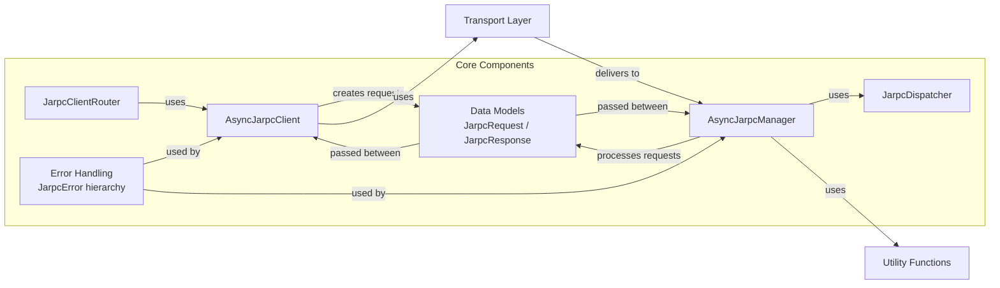

# Core components

This page provides an overview of the primary components that form the foundation of the jarpcdantic library. 
These components work together to facilitate JARPCdantic communications 
with strong type validation provided by Pydantic. For a high-level introduction to the library, see Overview.

## System Architecture

The JARPCdantic library consists of several interconnected components that handle different aspects 
of the RPC communication process. The following diagram illustrates these core components and their relationships:

## Component Overview

