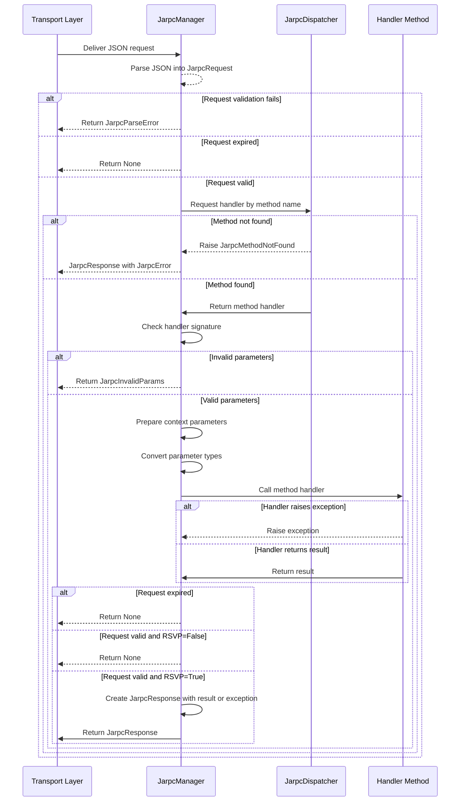
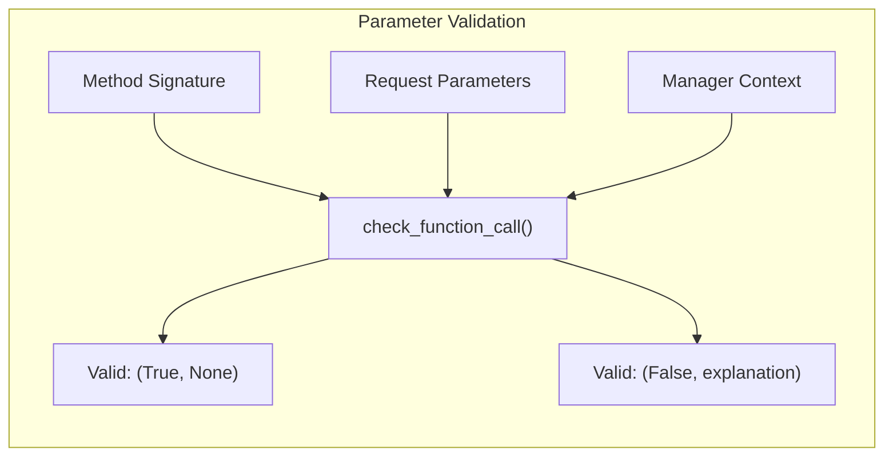
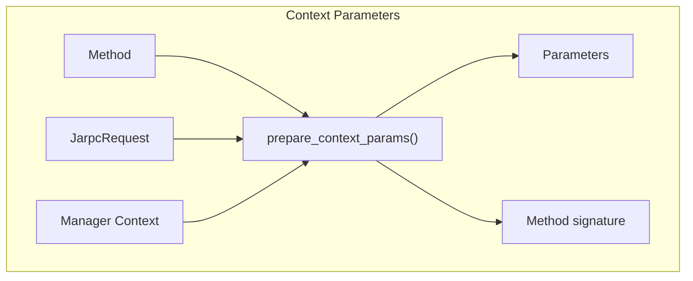
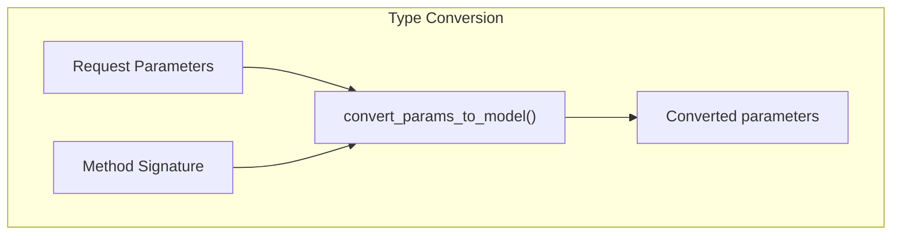
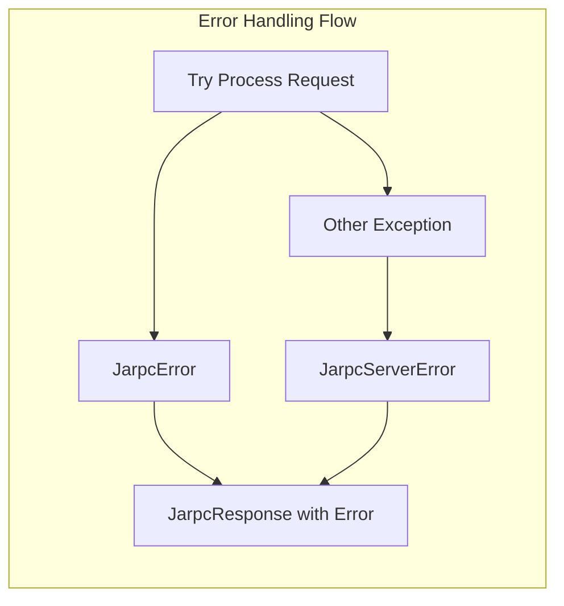

# Manager

## Purpose and Scope

This page details the JarpcManager and AsyncJarpcManager classes, which are the central server-side components 
in the jarpcdantic framework responsible for processing JSON-RPC requests. 
Managers handle request parsing, method dispatching, parameter validation, result processing, and error handling.

## Overview

Managers act as the core server-side components that receive incoming JSON-RPC requests, process them by invoking 
the appropriate handler methods, and produce responses. They serve as the bridge between the transport layer 
and your application's business logic.

## JarpcManager

The `JarpcManager` class is the primary server-side component responsible for processing JSON-RPC requests.

```python
class JarpcManager:
    def __init__(
        self,
        dispatcher: JarpcDispatcher,
        context: dict = None,
    ):
        ...
```

Key Attributes:
- dispatcher: The `JarpcDispatcher` instance responsible for mapping method names to handler functions.
- context: A dictionary to hold additional context of running manager.

## Core methods

### async def handle(request: str) -> str | None

Entry point for processing JSON-RPC request strings and producing response strings.


## Service methods

### async def get_response(self, request_string: str) -> JarpcResponse | None

Processes a JSON-RPC request string and returns the JarpcResponse or None.


### _call_method(self, jarpc_request: JarpcRequest) -> JarpcResponse | None

Internal method that invokes the target handler function with prepared parameters.

## Request Processing Flow



## Parameter Handling and Validation

Manager perform several key operations related to parameter handling and validation:

### Parameter Validation

The manager use `check_function_call()` to validate that the provided parameters match the target method signature.



### Context Parameters

The `prepare_context_params()` function extracts parameters from the context that match the method signature,



### Type Conversion

The manager use `convert_params_to_model()` to convert the provided parameters to the target method signature.



## Error Handling

Managers implement comprehensive error handling to catch both expected and unexpected errors:



Error types handled:

- `JarpcParseError`: When request parsing fails
- `JarpcInvalidParams`: When parameters don't match the method signature
- `JarpcServerError`: Wrapper for unexpected exceptions in handler methods
- Other `JarpcError` subclasses from the handler methods

## Usage Example

Here's an example usage of the `JarpcManager` class:

```python
# Setup
from jarpcdantic import JarpcDispatcher, JarpcManager

# Create a dispatcher
dispatcher = JarpcDispatcher()

# Register a method
@dispatcher.rpc_method
async def add(a: int, b: int) -> int:
    return a + b

# Or register a method with a custom name
@dispatcher.declare_method("any_sub")
def sub(a: int, b: int) -> int:
    return a - b

# Create a manager
manager = JarpcManager(dispatcher)

# Process a request
request_json = '{"method": "add", "params": {"a": 1, "b": 2}, "request_id": "123", "version": "1.0", "ts": 1617211200, "ttl": 30, "rsvp": true}'

async def main():
    response_json = await manager.handle(request_json)
    # The response will contain {"result": 3, ...}
```
