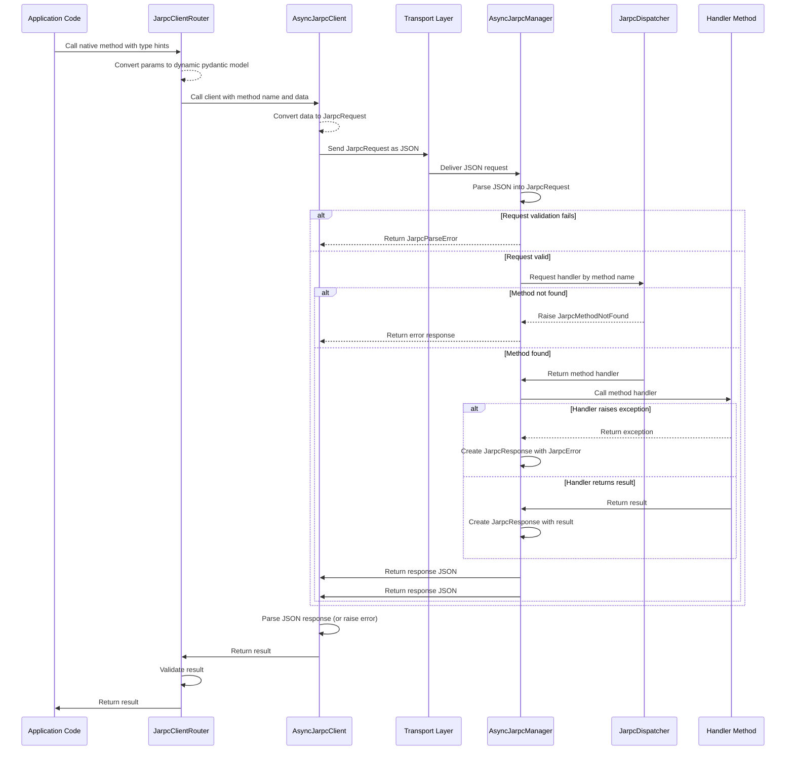

# Overview

JARPCdantic is a Python toolset for building modular, type-safe RPC systems using Pydantic.

It uses a JSON-RPC-like message format, but is not bound to the official JSON-RPC specification — instead, 
it adapts the core concepts to meet the real-world needs of internal service communication.

Originally inspired by an internal tool named [jarpc](https://git.angrydev.ru/public_repos/jarpc), 
JARPCdantic is a complete rewrite that introduces strong typing, validation, and developer ergonomics. 
It provides a unified way to define both client-side method calls and server-side handlers,
all with automatic serialization and structured error reporting.

Unlike many RPC systems, JARPCdantic does not prescribe a transport — it is transport-agnostic by design. 
You supply the communication layer (e.g., AMQP, Redis, HTTP), and JARPCdantic handles the rest: 
request modeling, method dispatching, and response validation.

Rather than being a library or a framework, JARPCdantic is a powerful and flexible building block 
for designing your own RPC layer with modern Python practices.

## Purpose and Scope

JARPCdantic aims to simplify and standardize how internal RPC interfaces are defined and maintained in Python projects.

By structuring both client-side calls and server-side handlers around the same Pydantic models and method definitions,  
JARPCdantic enables — but does not require — a single source of truth for request and response contracts.  
This pattern is especially effective when combined with `JarpcClientRouter`, which allows developers to define modular,  
nested RPC clients with clear method names, type hints, and autocompletion. Such client routers can be placed in a shared  
internal package and reused across services to ensure consistent communication.

While maintaining a shared router library introduces a bit of overhead — especially when evolving APIs —  
it greatly improves long-term maintainability, developer experience, and confidence in contract integrity.

Its core features include:

* Typed request and response models via Pydantic
* Built-in metadata support (e.g., trace_id, context propagation, authentication)
* Modular client routers with introspection, name inference, and full IDE autocompletion  
* Declarative handler registration on the server side
* Unified error system with Pydantic-based error models

The library is designed to be used in applications requiring reliable and type-safe remote procedure calls, 
from simple client-server interactions to complex microservice architectures.

## Key Components

### Client-Side Components

- **JarpcClientRouter**  
  Organizes RPC endpoints into modular, nested client classes with method name generation, 
  prefix management, and full IDE support.  
  Allows calling remote methods with typed parameters and responses using an attached `AsyncJarpcClient`.

- **AsyncJarpcClient**  
  Sends JSON-RPC-like requests over a user-supplied transport. 
  Automatically serializes parameters using Pydantic and deserializes responses to expected models.

### Server-Side Components

- **JarpcDispatcher**  
  Maps method names to handler functions and provides method lookup functionality. 
  Supports declarative registration via `@dispatcher.add_method()`.

- **AsyncJarpcManager**  
  Receives JSON-RPC-like requests, parses them using Pydantic models, dispatches to registered handlers, 
  and returns structured responses.

### Data Models

- **JarpcRequest**  
  Represents a JSON-RPC-like request, including the method name, parameters, optional metadata, and request ID.

- **JarpcResponse**  
  Represents a standardized response with either a result or a structured error.

All request and response models are based on Pydantic and provide automatic type validation and serialization 
for fields like `UUID`, `datetime`, and nested structures.

### Error Handling

JARPCdantic includes a structured error system based on a common `JarpcError` base class and Pydantic serialization.  
Each error includes a numeric code, message (with optional formatting), and additional data. Errors are returned in a consistent JSON-serializable format via a `JarpcErrorModel`.

A global `ExceptionManager` allows registering and raising custom error types, making it easy to define domain-specific errors with rich metadata.

Predefined errors cover standard cases like:

- `JarpcParseError` (`-32700`): invalid JSON
- `JarpcInvalidRequest` (`-32600`): malformed request
- `JarpcMethodNotFound` (`-32601`): unknown method
- `JarpcValidationError` (`-32001`): parameter validation failed
- `JarpcUnauthorized` (`401`): authentication required
- `JarpcForbidden` (`403`): permission denied
- `JarpcTimeout` (`408`): request timeout
- `JarpcExternalServiceUnavailable` (`503`): upstream service unavailable
- `JarpcUnknownError` (`-32999`): fallback for unregistered error codes

## Request Processing Flow

